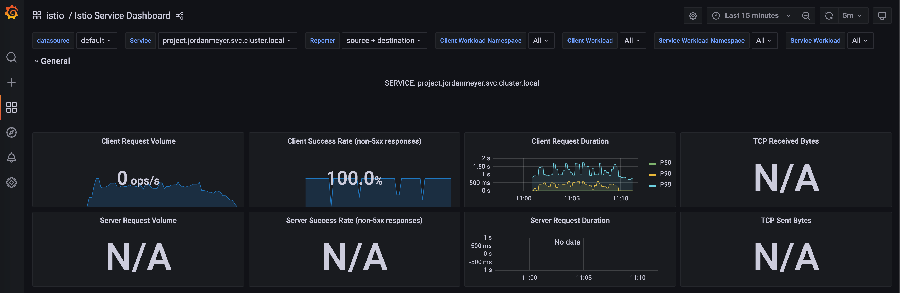
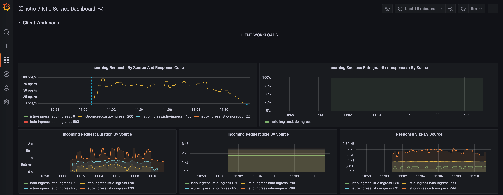
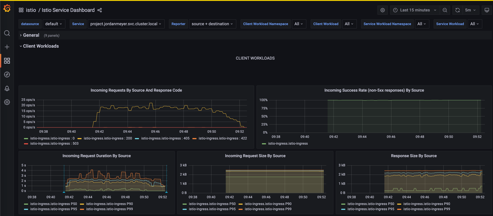

# Jordan Meyer Final Project
## Deploying a Sentiment Analysis NLP Model with Kubernetes in AKS
255 Machine Learning Systems Engineering  
James Winegar - Tue 6:30

### Objectives:
The goal of `project` is to take everything you've learned about managing deployments, performance, and testing for your application which has been deployed on `Azure Kubernetes Service (AKS)`.

- Package up an NLP model ([DistilBERT](https://arxiv.org/abs/1910.01108)) for running efficient CPU-based inferencing for POSITIVE/NEGATIVE sentiment
- Have results be cached to protect your endpoint from abuse
- Use `grafana` to understand the dynamics of your system.
- Leverage `k6` to load test your `/predict` endpoint
- Leverage `pytest` to ensure that your application works correctly prior to deployment on `AKS`.
- Leverage `poetry` to manage your runtime environment in a portable way.
- Leverage `Docker` to package applications in a reuseable fashion

### Repository Structure

This repository has a file structure corresponding to the `tree` below: 

```shell
[09:33:50] [~/Desktop/summer22-Jmdatasci/project] git(main) 🔥 ❱❱❱ tree
.
├── README.md
├── img_3.png
├── img_4.png
├── load.js
├── mlapi
│   ├── Dockerfile
│   ├── README.rst
│   ├── distilbert-base-uncased-finetuned-sst2
│   │   ├── README.md
│   │   ├── config.json
│   │   ├── pytorch_model.bin
│   │   ├── special_tokens_map.json
│   │   ├── tokenizer.json
│   │   ├── tokenizer_config.json
│   │   ├── training_args.bin
│   │   └── vocab.txt
│   ├── mlapi
│   │   ├── __init__.py
│   │   ├── __pycache__
│   │   │   ├── __init__.cpython-310.pyc
│   │   │   └── main.cpython-310.pyc
│   │   ├── example.py
│   │   └── main.py
│   ├── poetry.lock
│   ├── pyproject.toml
│   └── tests
│       ├── __init__.py
│       ├── __pycache__
│       │   ├── __init__.cpython-310.pyc
│       │   └── test_mlapi.cpython-310-pytest-7.1.2.pyc
│       └── test_mlapi.py
├── push.sh
└── trainer
    └── train.py

7 directories, 27 files
[09:33:51] [cost 0.133s] tree    
```

The directory `mlapi` holds the majority of the content including the `Dockerfile` that was used to build the container,
the `distilbert-...-sst2` directory which contains the fully trained `pytorch` model, a subdirectory `mlapi` which 
contains the App itself, the `poetry` files to handle the package management, the `tests` for the API `pytest` protocol. 

The other top level files are made up of screenshots from grafana, the `load.js` file used for load testing,
this `README.md` file, the `trainer` directory which can be used to retrain the model, and a `push.sh` file which is used
to hold various code chunks that were used throughout this project.

## API

#### Development
The first portion of this project was to download the previously trained model and reverse engineer `pydantic` classes 
based on the request inputs and the output which was found via testing the provided `example.py`. 

Expected Input: 
```json
{"text": [
   "example 1",
   "example 2"
  ]}
```

Expected Output:
```json
[ 
   [  {'label': 'NEGATIVE', 'score': 0.003582375356927514}, 
      {'label': 'POSITIVE', 'score': 0.9964176416397095}],
   
   [  {'label': 'NEGATIVE', 'score': 0.003582375356927514}, 
      {'label': 'POSITIVE', 'score': 0.9964176416397095}]
]

```

The final structure for the pydantic model is visible in `mlapi/main.py` 
shown below:  

```python
import logging
import os

from fastapi import FastAPI, Request, Response
from fastapi_redis_cache import FastApiRedisCache, cache_one_minute
from pydantic import BaseModel
from transformers import pipeline, AutoModelForSequenceClassification, AutoTokenizer


model_path = "./distilbert-base-uncased-finetuned-sst2"
model = AutoModelForSequenceClassification.from_pretrained(model_path)
tokenizer = AutoTokenizer.from_pretrained(model_path)
classifier = pipeline(
    task="text-classification",
    model=model,
    tokenizer=tokenizer,
    device=-1,
    return_all_scores=True,
)

logger = logging.getLogger(__name__)
LOCAL_REDIS_URL = "redis://redis:6379/0"
app = FastAPI()


@app.on_event("startup")
def startup():
    redis_cache = FastApiRedisCache()
    redis_cache.init(
        host_url=os.environ.get("REDIS_URL", LOCAL_REDIS_URL),
        prefix="mlapi-cache",
        response_header="X-MLAPI-Cache",
        ignore_arg_types=[Request, Response],
    )


class SentimentRequest(BaseModel):
    text: list[str]


class Sentiment(BaseModel):
    label: str
    score: float


class SentimentResponse(BaseModel):
    predictions: list[list[Sentiment]]


@app.post("/predict", response_model=SentimentResponse)
@cache_one_minute()
def predict(sentiments: SentimentRequest):
    return {"predictions": classifier(sentiments.text)}


@app.get("/health")
async def health():
    return {"status": "healthy"}

```
#### Testing  

Once the API model was ready I was able to test using `pytest` with the output below:  
```shell
[11:37:17] [~/Desktop/summer22-Jmdatasci/project/mlapi] git(main) 🔥 ❱❱❱ poetry run pytest -vv
=========================================================== test session starts ============================================================
platform darwin -- Python 3.10.5, pytest-7.1.2, pluggy-1.0.0 -- /Users/jordan/Library/Caches/pypoetry/virtualenvs/mlapi-Sllh4TEO-py3.10/bin/python
cachedir: .pytest_cache
rootdir: /Users/jordan/Desktop/summer22-Jmdatasci/project/mlapi
plugins: anyio-3.6.1
collected 1 item                                                                                                                           

tests/test_mlapi.py::test_predict PASSED                                                                                             [100%]

============================================================= warnings summary =============================================================
../../../../Library/Caches/pypoetry/virtualenvs/mlapi-Sllh4TEO-py3.10/lib/python3.10/site-packages/torch/nn/modules/module.py:1402
  /Users/jordan/Library/Caches/pypoetry/virtualenvs/mlapi-Sllh4TEO-py3.10/lib/python3.10/site-packages/torch/nn/modules/module.py:1402: UserWarning: positional arguments and argument "destination" are deprecated. nn.Module.state_dict will not accept them in the future. Refer to https://pytorch.org/docs/master/generated/torch.nn.Module.html#torch.nn.Module.state_dict for details.
    warnings.warn(

../../../../Library/Caches/pypoetry/virtualenvs/mlapi-Sllh4TEO-py3.10/lib/python3.10/site-packages/transformers/pipelines/text_classification.py:89
  /Users/jordan/Library/Caches/pypoetry/virtualenvs/mlapi-Sllh4TEO-py3.10/lib/python3.10/site-packages/transformers/pipelines/text_classification.py:89: UserWarning: `return_all_scores` is now deprecated, use `top_k=1` if you want similar functionnality
    warnings.warn(

-- Docs: https://docs.pytest.org/en/stable/how-to/capture-warnings.html
====================================================== 1 passed, 2 warnings in 3.57s =======================================================
[11:37:26] [cost 7.951s] poetry run pytest -vv   
```

While the API tests passed themselves, there were two warnings issued. As we are playing the role of deployment, 
these warnings may be passed along to the data science team. 

## Deployment
#### Containerizing  

After passing the tests, the next step was to package the model into a docker container that can be portably deployed 
for hosting in Azure Kubernetes Service (AKS). To keep the container size to a minimum (as this is a large model), 
I used a `slim-buster` version of python for the build and deployment stages.

The container was built and then pushed to Azure Container Repository (ACR) with the following commands. 

```shell
IMAGE_PREFIX=jordanmeyer
IMAGE_NAME=project
ACR_DOMAIN=w255mids.azurecr.io
TAG=0964d58 #Tag from the last model commit
IMAGE_FQDN="${ACR_DOMAIN}/${IMAGE_PREFIX}/${IMAGE_NAME}:${TAG}"

docker build --platform linux/amd64 --no-cache -t ${IMAGE_NAME}:${TAG} .
docker tag "${IMAGE_NAME}" ${IMAGE_FQDN}
docker push "${IMAGE_FQDN}"
docker pull "${IMAGE_FQDN}"
```

The container was then tested locally to make sure everything worked as expected before landing into AKS.  

#### Landing in AKS
The next stage was to set up the AKS infrastructure for my `jordanmeyer` namespace. The full structure is available
in the subfolder `.k8s/`.  Using the magic of `Kubernetes` I was able to easily bring all of my structure to life with 
a single command of:
```shell
kubectl apply -k .k8/overlays/prod
```
This command first brings up all bases files along with what is needed to run in production on AKS.  Through
troubleshooting I found that the initial resources we alotted for prior models were not sufficient, so I increased the memory to 
hold such a large container/model. Additionally, upon initial load tests it was found that we needed more worker
pods to handle the sustained load so the CPU resource and the autoscaler were adjusted to accommodate. 

After everything came up I was able to verify the API was online by sending an example curl request as seen below:
```shell
curl -X 'POST' 'https://jordanmeyer.mids-w255.com/predict' -L -H 'Content-Type: application/json' -d '{"text": ["I hate you.", "I love you."]}'
```


## Grading

Grades will be given based on the following:

1. Adhesion to requirements and rubric

### Rubric

All items are conditional on a `95%` cache rate, and after a `10 minute` sustained load:

- `pytest` (provided) pass for your project: 2 point
- `Model` is loaded into the container as part of the build process instead of being dynamically pulled down from `HuggingFace` on model instantiation: 2 point
- Ability to hit `/predict` endpoint and get sentiment responses: 2 points
- Ability to hit `/predict` endpoint 10/s: 2 points
- p(99) < 2 second for `/predict` endpoint under 10 Virtual User (`k6` VU) load: 2 points

## Load Test

#### Test protocol

Using the `load.js` script below, I simulate 10 active users ramping up for 30 seconds and then executing continuously for 
7 more minutes. Once the sustained load portion is completed, the script begins to ramp down virtual users over the next
3 minutes. This serves as an example of how the service would perform had there been a real production workload of 
this size.  We also set the requirement that 99% of all queries __(P(99))__ below must be resolved within 2 seconds of 
the `post` request.  Additionally, we have used a cache rate of 0.95 which represents a scenario where 95% of the 
queries are repeated leading our cluster to pull the results from the `redis` cache rather than executing the more 
expensive `/predict` method of our API.

```python  
# load.js
import http from 'k6/http';
import {
    check,
    group,
    sleep
} from 'k6';
export const options = {
    stages: [
            {duration: '30s', target: 10}, // simulate ramp-up of traffic from 1 to 10 users over 30 seconds. {
            {duration: '7m', target: 10}, // stay at 10 users for 7 minutes
            {duration: '3m', target: 0 }, // ramp-down to 0 users
    ],
    thresholds: {
        'http_req_duration': ['p(99)<2000'] // 99% of requests must complete below 2 s
    },
};
const fixed = ["I love you!", "I hate you!", "I am a Kubernetes Cluster!"]
var random_shuffler = [
    "I love you!",
    "I hate you!",
    "I am a Kubernetes Cluster!",
    "I ran to the store",
    "The students are very good in this class",
    "Working on Saturday morning is brutal",
    "How much wood could a wood chuck chuck if a wood chuck could chuck wood?",
    "A Wood chuck would chuck as much wood as a wood chuck could chuck if a woodchuck could chuck wood ",
    "Food is very tasty",
    "Welcome to the thunderdome"
];
const generator = (cacheRate) => {
    const rand = Math.random()
    const text = rand > cacheRate ?
        random_shuffler.map(value => ({
            value,
            sort: Math.random()
        }))
        .sort((a, b) => a.sort - b.sort)
        .map(({
            value
        }) => value) :
        fixed
    return {
        text
    }
}

const NAMESPACE = 'jordanmeyer'
const BASE_URL = `https://${NAMESPACE}.mids-w255.com`;
const CACHE_RATE = 0.95

export default () => {
    const healthRes = http.get(`${BASE_URL}/health`)
    check(healthRes, {
        'is 200': (r) => r.status === 200
    })
    const payload = JSON.stringify(generator(CACHE_RATE))
    const predictionRes = http.request('POST', `${BASE_URL}/predict`, payload)
    check(predictionRes, {
        'is 200': (r) => r.status === 200
    })
};
```

#### Load Test Results
```shell
# Results
[~/Desktop/summer22-Jmdatasci/project] git(main) 🔥 ❱❱❱ k6 run --summary-trend-stats "min,avg,med,max,p(50),p(90),p(95),p(99)" load.js

          /\      |‾‾| /‾‾/   /‾‾/   
     /\  /  \     |  |/  /   /  /    
    /  \/    \    |     (   /   ‾‾\  
   /          \   |  |\  \ |  (‾)  | 
  / __________ \  |__| \__\ \_____/ .io

  execution: local
     script: load.js
     output: -

  scenarios: (100.00%) 1 scenario, 10 max VUs, 11m0s max duration (incl. graceful stop):
           * default: Up to 10 looping VUs for 10m30s over 3 stages (gracefulRampDown: 30s, gracefulStop: 30s)


running (10m30.1s), 00/10 VUs, 20196 complete and 0 interrupted iterations
default ✓ [======================================] 00/10 VUs  10m30s

     ✗ is 200
      ↳  99% — ✓ 40387 / ✗ 5

     checks.........................: 99.98% ✓ 40387     ✗ 5    
     data_received..................: 11 MB  18 kB/s
     data_sent......................: 3.8 MB 6.0 kB/s
     http_req_blocked...............: min=0s       avg=110.63µs med=1µs     max=3.28s    p(50)=1µs     p(90)=1µs      p(95)=1µs      p(99)=1µs     
     http_req_connecting............: min=0s       avg=16.3µs   med=0s      max=151.03ms p(50)=0s      p(90)=0s       p(95)=0s       p(99)=0s      
   ✓ http_req_duration..............: min=51.22ms  avg=131.95ms med=58.86ms max=2.38s    p(50)=58.86ms p(90)=400.8ms  p(95)=694.29ms p(99)=1.05s   
       { expected_response:true }...: min=51.22ms  avg=131.92ms med=58.86ms max=2.38s    p(50)=58.86ms p(90)=399.78ms p(95)=694.31ms p(99)=1.05s   
     http_req_failed................: 0.01%  ✓ 5         ✗ 40387
     http_req_receiving.............: min=15µs     avg=61.99µs  med=53µs    max=78.68ms  p(50)=53µs    p(90)=85µs     p(95)=90µs     p(99)=109µs   
     http_req_sending...............: min=27µs     avg=126.55µs med=110µs   max=2ms      p(50)=110µs   p(90)=211µs    p(95)=256µs    p(99)=353.08µs
     http_req_tls_handshaking.......: min=0s       avg=15.2µs   med=0s      max=65.65ms  p(50)=0s      p(90)=0s       p(95)=0s       p(99)=0s      
     http_req_waiting...............: min=50.98ms  avg=131.77ms med=58.67ms max=2.38s    p(50)=58.67ms p(90)=400.49ms p(95)=694.1ms  p(99)=1.05s   
     http_reqs......................: 40392  64.107835/s
     iteration_duration.............: min=105.38ms avg=264.44ms med=118.9ms max=3.59s    p(50)=118.9ms p(90)=756.14ms p(95)=871.89ms p(99)=1.4s    
     iterations.....................: 20196  32.053917/s
     vus............................: 1      min=1       max=10 
     vus_max........................: 10     min=10      max=10 
     
[11:11:04] [cost 633.603s] k6 run --summary-trend-stats "min,avg,med,max,p(50),p(90),p(95),p(99)" load.js
```

#### Dashboard Visualizations

Using `grafana`, we can graphcially view the data being captured in real time  in the `prometheus` sidecar implementation.  
We can see the number of requests increases during the on-ramp portion, remains relatively constant in the 7 minute test 
and decreases over time in the 3-minute ramp down. 




To respond to this load we can see the latency slowly creeps up until
more pods come online at which point the latency drops before the cluster begins to start getting backed up needing more
pods to handle the load. I ended up with 13 pods with 1Gi Memory and 1Gi CPU resource each along with a target 
CPU utilization of 25% to handle the full sustained load and keep the P(99) latency under 2 seconds.

### Bonus Load Test

To see the impact to performance with a different cache rate I have re-run the load test using a cache rate of 0.5 
meaning half of all queries are brand new and the other half are repeated.  
 
From the request duration chart on the bottom left it becomes immediately apparent that the cache rate has a huge impact
in the latency as the plot shows similar patterns but now the latency axis ranges from 0-2 seconds
to 0-5 seconds. 

From the `k6` report we also get notified that we failed the P(99) 2 second target in this instance and we end 
with a 2.48s average P(99) latency. If we were to 
expect many unique queries like this in production we would need more resource to handle these predictions as these are 
very expensive computationally vs the cached requests. Below is the `k6` report.

```shell
[09:41:13] [~/Desktop/summer22-Jmdatasci/project] git(main) 🔥 ❱❱❱ k6 run --summary-trend-stats "min,avg,med,max,p(50),p(90),p(95),p(99)" load.js

          /\      |‾‾| /‾‾/   /‾‾/   
     /\  /  \     |  |/  /   /  /    
    /  \/    \    |     (   /   ‾‾\  
   /          \   |  |\  \ |  (‾)  | 
  / __________ \  |__| \__\ \_____/ .io

  execution: local
     script: load.js
     output: -

  scenarios: (100.00%) 1 scenario, 10 max VUs, 11m0s max duration (incl. graceful stop):
           * default: Up to 10 looping VUs for 10m30s over 3 stages (gracefulRampDown: 30s, gracefulStop: 30s)


running (10m30.2s), 00/10 VUs, 5063 complete and 0 interrupted iterations
default ✓ [======================================] 00/10 VUs  10m30s

     ✗ is 200
      ↳  99% — ✓ 10115 / ✗ 11

     checks.........................: 99.89% ✓ 10115    ✗ 11   
     data_received..................: 4.6 MB 7.4 kB/s
     data_sent......................: 1.7 MB 2.7 kB/s
     http_req_blocked...............: min=0s      avg=135.41µs med=1µs      max=341.05ms p(50)=1µs      p(90)=1µs   p(95)=1µs   p(99)=1µs    
     http_req_connecting............: min=0s      avg=53.18µs  med=0s       max=59.32ms  p(50)=0s       p(90)=0s    p(95)=0s    p(99)=0s     
   ✗ http_req_duration..............: min=48.28ms avg=527.62ms med=228.29ms max=4.97s    p(50)=228.29ms p(90)=1.34s p(95)=1.67s p(99)=2.48s  
       { expected_response:true }...: min=48.28ms avg=527.4ms  med=226.69ms max=4.97s    p(50)=226.69ms p(90)=1.34s p(95)=1.67s p(99)=2.48s  
     http_req_failed................: 0.10%  ✓ 11       ✗ 10115
     http_req_receiving.............: min=18µs    avg=77.07µs  med=72µs     max=69.78ms  p(50)=72µs     p(90)=90µs  p(95)=95µs  p(99)=120µs  
     http_req_sending...............: min=30µs    avg=150.29µs med=140µs    max=3.44ms   p(50)=140µs    p(90)=230µs p(95)=286µs p(99)=353.5µs
     http_req_tls_handshaking.......: min=0s      avg=70.75µs  med=0s       max=181.13ms p(50)=0s       p(90)=0s    p(95)=0s    p(99)=0s     
     http_req_waiting...............: min=48.07ms avg=527.39ms med=228.13ms max=4.97s    p(50)=228.13ms p(90)=1.34s p(95)=1.67s p(99)=2.48s  
     http_reqs......................: 10126  16.06797/s
     iteration_duration.............: min=99.68ms avg=1.05s    med=921.52ms max=6.18s    p(50)=921.52ms p(90)=2.05s p(95)=2.39s p(99)=3.28s  
     iterations.....................: 5063   8.033985/s
     vus............................: 1      min=1      max=10 
     vus_max........................: 10     min=10     max=10 

ERRO[0630] some thresholds have failed                  
[09:51:53] [cost 630.804s] k6 run --summary-trend-stats "min,avg,med,max,p(50),p(90),p(95),p(99)" load.js      
```